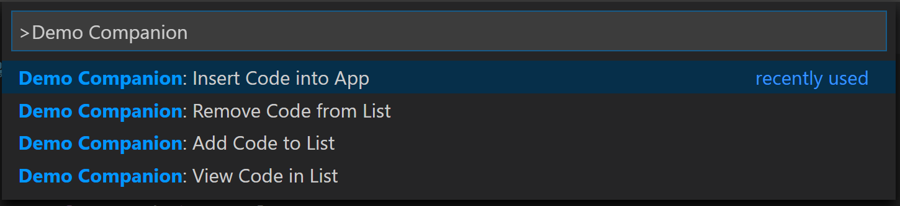
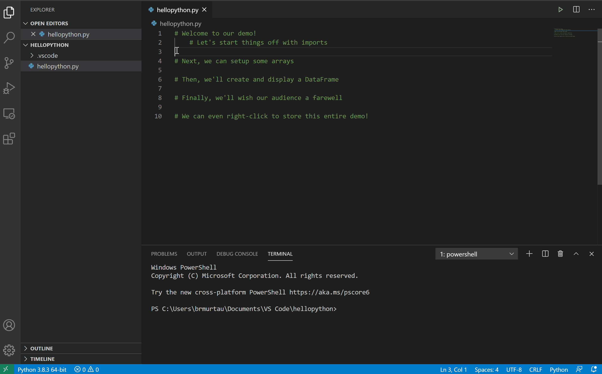
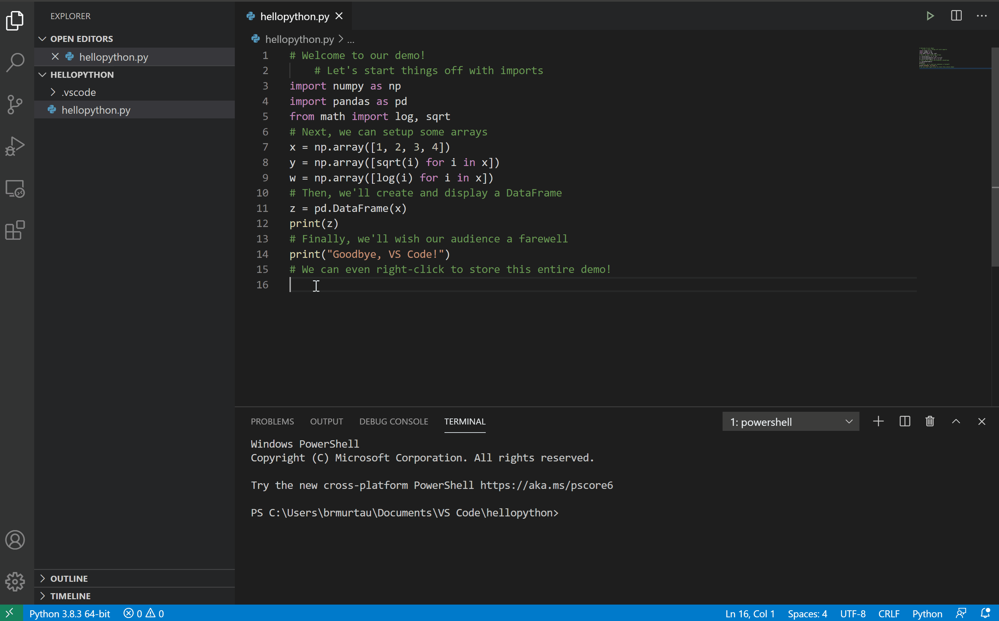
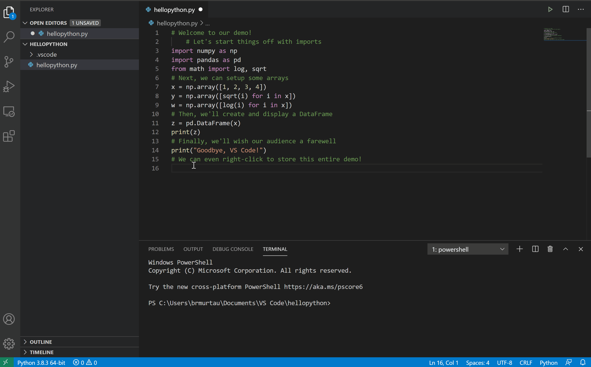
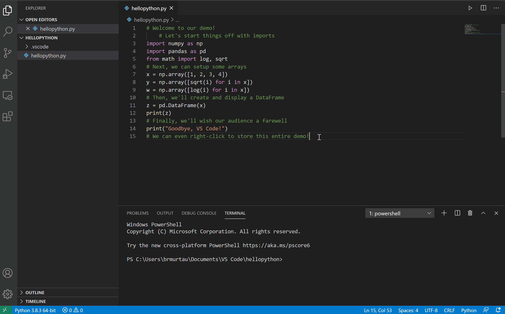

# Demo Companion

Demo Companion seeks to speed up and simplify the process of inserting code into an app while giving a talk or demo. 

Coding live is a great way to to interact with an audience or break down complex topics line-by-line, but it can be challenging to remember exactly what you want to type or doing so quickly without errors. 

Demo Companion allows you to store lines of code in order so that you can insert them easily when you're reading to use them in your talk, and you can also add and view the lines you've already inserted.

## Features

* Insert Code: Insert saved line(s) of code into your app.

* Add Code: Save new line(s) of code in the Command Palette, which can be inserted later.

* Right-click to add code: Highlight line(s) of code and save them to your list of saved code.

* Remove Code: Remove a saved piece of code from your list.

* View Code: View the code you have saved in your list.

## Optional Requirements

*Optional* The template code included in the "Insert Code" command is in Python. If you'd like to try it out, you'll need to configure a Python development environment. Learn more at https://code.visualstudio.com/docs/python/python-tutorial.

### 1.0.0

This is the initial release of Demo Companion! For any questions or feedback, please feel free to reach out to the creator at https://twitter.com/BrigitMurtaugh.

**Enjoy!**